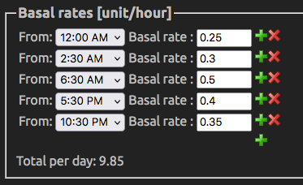

# Initial Settings

The following *Settings* are listed in order of appearance in the *FAX-ng* app.  
If not mentioned, leave the existing _Default Settings_.

- **Click** the _Cog Wheel_ (bottom right of the FAX-ng screen)

## SERVICES

### Nightscout
- *URL* - **Your Nightscout URL** ( NO / at the end)
- *Password* -  **Your API Secret** as the *password*
- **Connect** - Tap --> *Connected!*
- *Allow Uploads* - **Enable**

### CGM
- *Type* - **Dexcom G6**
- *Transmitter ID* - **Enter current**

### Notifications
- Your choice, e.g. **All** turned **Off**, set **High ---> 10**

## CONFIGURATION

### Preferences

#### FREEAPS X
- *Recommended Insulin Fraction* **> 2**

#### OPENAPS MAIN Settings
- *Insulin Curve* - Set to the **type of insulin** you are using
- *Max IOB* - **raise to 10**

#### DYNAMIC SETTINGS
- *Dynamic CR* - **Enable**
- *Adjust Basal* - **Enable**

#### OPENAPS SMB SETTINGS
- *Enable SMB ...* options - **Enable All**
- *Enable UAM* - **Enable**
- *Max Delta-BG Threshold SMB* **> 0.3**
- *SMB Interval* **> 1**
- *Bolus Increment* **> 0.05 *ONLY if using Omnipod***

#### OPENAPS TARGETS SETTINGS
- *High TempTarget Raises Sensitivity* - **Enable**
- *Low TempTarget Raises Sensitivity* - **Enable**
- *Sensitivity Raises Target* - **Enable**
- *Resistance Lowers Target* - **Enable**

### Basal Profile
- Copy from old **Loop, FAX** or **Nightscout**,, or as advised.

<figcaption>_Example Basal Profile listed in Nightscout profile_</figcaption>

### Insulin Sensitivities
- **Use _Autotune_ value**

### Carb Ratios
- **Use _Autotune calculated value_**

## Target Ranges
- **Set to whatever range with which you are comfortable**  
**Lower range** is the one that matters e.g. 5.5 - 5.5, 24/7

## Autotune 
- **Enable**

## Connect To Apple Health
- **Enable**
- You must also **Enable Read** and **Write** to **FreeAPS X NextGen** in **Apple Health**:
  - _iPhone Settings --> Health --> FreeAPS --> Blood Glucose_

